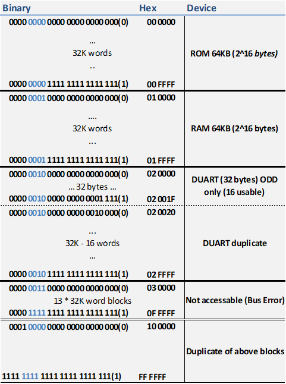

# KOMODO Monitor Program #

# TODO #
 - [ ] User/Super mode?

Program memory Structure
|    Address | Purpose                                      |
| ---------: | :------------------------------------------- |
|      *ROM* |                                              |
|  `00_0000` | Exception Vector table                       |
|  `00_8000` | Monitor program start                        |
| ` 00_88CA` | Command table start                          |
|  `00_891E` | String Constant storage                      |
|      *RAM* |                                              |
|  `01_0000` | Program Data. Global variables & line buffer |
|  `01_1000` | Recommended user program locations           |
|  `01_FFF0` | System Stack start. Fills up from bottom     |
|   *DEVICE* |                                              |
|   `02_000` | Serial device start (odd addresses only)     |

Many subroutines set flags in D7 to indicate error
| D7 Bit | Flag                    |
| :----: | :---------------------- |
|   0    | invalid hex input       |
|   1    | invalid hex parameter   |
|   2    | S-Record checksum error |

System Calls available with TRAP    #15
Put task number in D0.B
| Task  | Usage                                                                                   |
| :---: | :-------------------------------------------------------------------------------------- |
|   0   | Print the byte in D1.B                                                                  |
|   1   | Print the word in D1.W                                                                  |
|   2   | Print Lowest 6 bytes in D1                                                              |
|   3   | Print the longword in D1.L                                                              |
|   4   | Print newline                                                                           |
|   5   | Read single ascii character into D1.B                                                   |
|   6   | Display single ascii character in D1.B                                                  |
|   7   | Read a hex character into D1. All input routines set D7 bit 0 (LSB) on conversion error |
|   8   | Read a hex byte into D1.B                                                               |
|   9   | Read a hex word into D1.W                                                               |
|  10   | Read a longword into D1.L                                                               |
|  11   | Toggle input upper case conversion. D1.B=0 (disable), !=0 (enable, default)             |
|  12   | Toggle keyboard echo. D1.B=0 (disable), !=0 (enabled, default)                          |
|  13   | Display Null terminated string at A1 with trailing CR,LF                                |
|  14   | Display Null terminated string at A1                                                    |

## Full Hardware Memory Map ##
